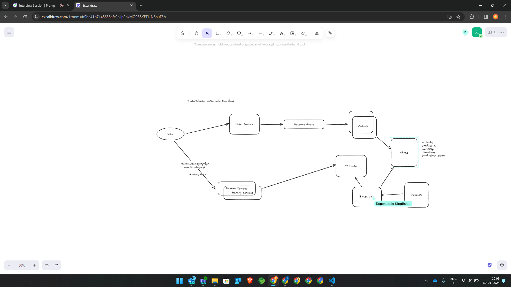

Scale on the Cloud
Many of today’s large scale concurrent systems rely on cloud computing platforms such as AWS or Google Cloud.

Describe how would you design a service using a common cloud computing platform such as AWS, to scale incrementally from supporting hundreds of users to millions of users.

For the purpose of the interview, assume the system generally receives user requests, does some processing, stores user data, and returns the results.

### solution

#### scaling thresholds

60% - 80% - cpu
50% - 70% - memory

0 - 10   => 2
10 - 50  => 3
50 - 100  => 5

#### data rellocation

max 40-60 GB / DB instance 
5 machines
40 GB /DB
traffic increased => more users joined => much more data => 65 GB / DB
add 2 more machines and do the data reallocation
=> we should use consistent hashing with logical sharding to avoid lot of data movement

#### for arch and more details refer this
https://github.com/donnemartin/system-design-primer/tree/master/solutions/system_design/scaling_aws#design-a-system-that-scales-to-millions-of-users-on-aws

#### sales rank (arch)

